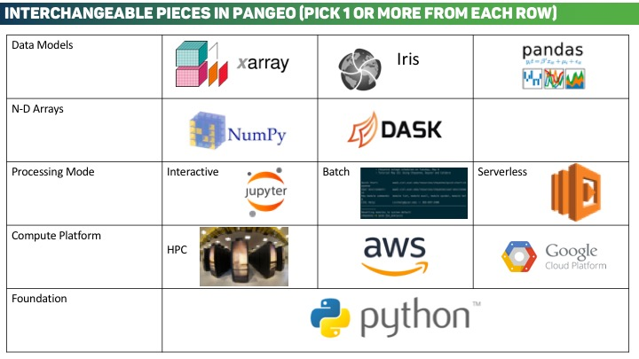

.. _architecture:

Technical Architecture
======================

Interoperability, extensibility, and portability are core concepts defining
the Pangeo technical architecture. Rather than designing and creating a single
monolithic application, our vision is an ecosystem of tools that can be used
together. We want you to be able to easily build your own Pangeo, whatever that
means to you.

Where we began
--------------

In large part, Pangeo began as a group of `Xarray`_ users and developers that
were working on various big-data geoscience problems. The typical software and
hardware stack we envisioned for Pangeo is shown in the figure below.

.. image:: _static/pangeo_tech_1.png
   :height: 300px

The key concepts and tools we envisioned in the Pangeo ecosystem were:

- Ability to use high-level data models (e.g. `Xarray`_)
- Ability to leverage distributed parallel computing (e.g. `Dask`_) on HPC systems or on
  cloud computing systems
- Ability to work interactively (e.g. `Jupyter`_) or using batch processing

Although we originally envisioned Pangeo's focus to be on improving the
integration of Xarray, Dask, and Jupyter on HPC systems, the scope of the
project has grown substantially.

Interoperability in Pangeo
--------------------------

Pangeo's ecosystem of interoperable tools allows users to pick and choose from a
collection of related but independent packages and approaches. This facilitates
portability and customization in user workflows. The illustration below
highlights some of the interchangeable components within Pangeo.

Software
--------

The Pangeo software stack a collection of Python libraries that when used
together facilitate scalable analysis. The packages themselves are described
in more detail in the :ref:`packages` section.

Python
~~~~~~

The Python programming is quickly becoming the standard language in the
open-source data science world. The core packages in the Pangeo stack are all
built using Python.

Data Models
~~~~~~~~~~~

Pangeo utilizes advanced self-describing data models. Examples of these data
models are `Pandas`_ and `Xarray`_. These data models, coupled with
their built in toolkits, allow for expressive high-level data analysis on
complex datasets.

Arrays
~~~~~~

N-dimensional arrays of numbers are ubiquitous throughout the
computational sciences. In Python, the most common array format is provided by
the `NumPy`_ library. `NumPy`_ provides homogeneous in memory arrays is has
been widely adopted throughout the PyData ecosystem. `Dask`_ is a library for
parallel computing in Python and provides a chunked-lazy NumPy-like array API.
Xarray and Pandas both support both NumPy and Dask arrays internally.

Compute Platforms
-----------------

HPC
~~~

Large homogeneous high-performance computing clusters are the most common
big-data computing platform in the geosciences today. They often offer many
compute nodes, fast interconnects, and parallel file systems - all of which can
be used to facilitate rapid scientific analysis.

Cloud
~~~~~

Commercial Cloud Computing offers the scientific community a fundamentally new
model for doing data science. A specific focus of Pangeo is the development of
scalable, flexible, and configurable cloud deployments. Our flagship deployment
is `pangeo.pydata.org <http://pangeo.pydata.org>`__ running on Google Cloud
Platform.

Storage Formats
---------------

HDF and NetCDF
~~~~~~~~~~~~~~

The Hierarchical Data Format (HDF) and the Network Common Data Format (NetCDF)
are two of the most common on-disk storage layers across the geosciences. The
ability to read and write datasets in these common formats in a scalable manor,
in conjunction with the rest of the Pangeo stack, is an ongoing focus of Pangeo.

Storage on the Cloud
~~~~~~~~~~~~~~~~~~~~

How we should store large N-dimensional arrays in the cloud storage context is
an open question. Pangeo is developing `evaluation tools
<https://github.com/pangeo-data/storage-benchmarks>`_ to help better understand
the performance of current methods for storing complex data in the cloud.

.. _Xarray: http://xarray.pydata.org
.. _Dask: https://dask.pydata.org
.. _Pandas: https://pandas.pydata.org
.. _NumPy: http://www.numpy.org/
.. _Jupyter: https://jupyter.org
