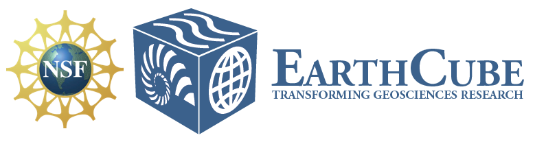

.. _collaborators:

Collaborators
=============

Funding Agencies
----------------

US NSF EarthCube Program
~~~~~~~~~~~~~~~~~~~~~~~~

Pangeo currently receives support from the NSF `EarthCube Program`_, which funds
cyberinfrastructure projects related to Earth Science. This award supports
scientists and developers at Lamont Doherty Earth Observatory, National
Center for Atmospheric Research, and Anaconda Inc.
The public details of the awards can be found on the NSF website:

- `LDEO Award <https://www.nsf.gov/awardsearch/showAward?AWD_ID=1740648&HistoricalAwards=false>`_
- `NCAR Award <https://www.nsf.gov/awardsearch/showAward?AWD_ID=1740633&HistoricalAwards=false>`_

Anaconda is funded via a subaward through Columbia.
We were awarded $1.2M over a three year period (Oct. 2017 - Sept. 2020).

The specific solicitation we responded to is
`here <https://www.google.com/url?q=https%3A%2F%2Fwww.nsf.gov%2Fpubs%2F2016%2Fnsf16514%2Fnsf16514.htm&sa=D&sntz=1&usg=AFQjCNHKvXj9L4pTCnv7Ls8k6Cj5L2Iu-w>`_.
Our project is technically called an “EarthCube integration.” This type of project requires a close link to “Geoscience Use Cases,” i.e. actual science applications.
The need to closely intertwine the technical development and the scientific applications determined the structure of our proposal and the makeup of the team.

The proposal Project Description, entitled
*Pangeo: An Open Source Big Data Climate Science Platform*
is published under a CC BY 4.0 license on Figshare:

- https://figshare.com/articles/Pangeo_NSF_Earthcube_Proposal/5361094

You may share and adapt this document as you wish, but please acknowledge the authors.

.. _EarthCube Program: https://earthcube.org/

Sloan Foundation
~~~~~~~~~~~~~~~~

Early work on Pangeo was partly supported via the
`Alfred P. Sloan foundation <https://sloan.org/>`_, via a Sloan Research
Fellowship in Ocean Sciences awarded to Ryan Abernathey in 2016.

Institutions
------------

Lamont Doherty Earth Observatory
~~~~~~~~~~~~~~~~~~~~~~~~~~~~~~~~

National Center for Atmospheric Research
~~~~~~~~~~~~~~~~~~~~~~~~~~~~~~~~~~~~~~~~

Continuum Analytics
~~~~~~~~~~~~~~~~~~~

UK Met Office
~~~~~~~~~~~~~

People
------
